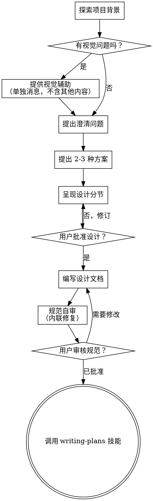

# 头脑风暴：将想法转化为设计

通过自然的协作对话，帮助将想法转化为完整的设计和规范。

首先了解当前项目背景，然后逐一提问来完善想法。一旦理解你要构建的内容，呈现设计并获得用户批准。

<HARD-GATE>
在呈现设计并获得用户批准之前，不得调用任何实现技能、编写任何代码、搭建任何项目或采取任何实现行动。这适用于所有项目，无论感知到的复杂性如何。
</HARD-GATE>

## 反模式："这太简单了，不需要设计"

每个项目都要经过这个过程。待办列表、单一功能工具、配置更改——都是如此。"简单"项目正是未经审视的假设造成最大浪费的地方。设计可以很短（真正简单的项目几句话就够），但你必须呈现它并获得批准。

## 检查清单

你必须为每个项目创建一个任务，并按顺序完成：

1. **探索项目背景** — 检查文件、文档、最近的提交
2. **提供视觉辅助**（如果主题涉及视觉问题）— 这是单独的消息，不要与澄清问题合并。参见下面的视觉辅助部分。
3. **提出澄清问题** — 一次一个，理解目的/约束/成功标准
4. **提出 2-3 种方案** — 包含权衡和你的推荐
5. **呈现设计** — 按复杂度分节呈现，每节后获得用户批准
6. **编写设计文档** — 保存到 `docs/superpowers/specs/YYYY-MM-DD-<topic>-design.md` 并提交
7. **规范自审** — 快速检查是否有占位符、矛盾、歧义、范围问题（见下文）
8. **用户审核书面规范** — 要求用户在继续之前审核规范文件
9. **过渡到实现** — 调用 writing-plans 技能创建实施计划

## 流程图

**最终状态是调用 writing-plans。** 不要调用 frontend-design、mcp-builder 或任何其他实现技能。头脑风暴之后唯一调用的技能是 writing-plans。

## 流程详解

**理解想法：**

- 首先检查当前项目状态（文件、文档、最近的提交）
- 在提出详细问题之前，评估范围：如果请求描述了多个独立子系统（例如"构建一个包含聊天、文件存储、计费和分析的平台"），立即标记这一点。不要在需要首先分解的项目上花费问题来完善细节。
- 如果项目太大无法包含在单个规范中，帮助用户分解为子项目：有哪些独立的部分，它们如何关联，应该按什么顺序构建？然后通过正常的设计流程头脑风暴第一个子项目。每个子项目都有自己的规范 → 计划 → 实现周期。
- 对于规模适当的项目，一次提一个问题来完善想法
- 尽可能使用多选问题，但开放式也没问题
- 每条消息只问一个问题——如果某个主题需要更多探索，拆分为多个问题
- 专注于理解：目的、约束、成功标准

**探索方案：**

- 提出 2-3 种不同的方案及其权衡
- 以对话方式呈现选项，包含你的推荐和理由
- 首先说明你推荐的选项并解释原因

**呈现设计：**

- 一旦你认为理解了要构建的内容，就呈现设计
- 根据每节的复杂度调整篇幅：简单的几句话，复杂的可达 200-300 词
- 每节后询问是否看起来正确
- 涵盖：架构、组件、数据流、错误处理、测试
- 准备好在某些内容不合理时回头澄清

**设计要隔离和清晰：**

- 将系统拆分为更小的单元，每个单元有一个明确的目的，通过定义良好的接口通信，可以独立理解和测试
- 对于每个单元，你应该能够回答：它做什么，你怎么使用它，它依赖什么？
- 是否有人可以在不阅读内部实现的情况下理解一个单元做什么？是否可以在不破坏消费者的情况下更改内部实现？如果不是，边界需要改进。
- 更小、边界更清晰的单元也更容易与你合作——你能够更好地推理可以一次性掌握上下文 的代码，当文件保持专注时你的编辑更可靠。当一个文件变得很大时，这通常是一个信号，表明它做得太多了。

**在现有代码库中工作：**

- 在提出更改之前探索当前结构。遵循现有模式。
- 如果现有代码有问题影响工作（例如一个变得太大的文件、模糊的边界、混乱的职责），将针对性的改进作为设计的一部分——就像一个好的开发者在工作时改进代码一样。
- 不要提出无关的重构。专注于服务于当前目标的内容。

## 设计之后

**文档：**

- 将验证过的设计（规范）写入 `docs/superpowers/specs/YYYY-MM-DD-<topic>-design.md`
  -（用户对规范位置的偏好优先于此默认位置）
- 如果 elements-of-style:writing-clearly-and-concisely 技能可用，使用它
- 将设计文档提交到 git

**规范自审：**
编写规范文档后，以新的视角审视：

1. **占位符扫描：** 是否有任何 "TBD"、"TODO"、不完整的部分或模糊的需求？修复它们。
2. **内部一致性：** 是否有任何部分相互矛盾？架构是否与功能描述匹配？
3. **范围检查：** 这个规范是否足够专注，可以作为一个单独的实施计划，还是需要分解？
4. **歧义检查：** 是否有任何需求可以有两种不同的解释？如果是这样，选择一种并明确说明。

内联修复任何问题。不需要重新审核——直接修复并继续。

**用户审核门：**
规范审核循环通过后，在继续之前要求用户审核书面规范：

> "规范已编写并提交到 `<path>`。请审核，如果想在开始编写实施计划之前进行任何更改，请告诉我。"

等待用户的回复。如果他们请求更改，进行更改并重新运行规范审核循环。只有在用户批准后才能继续。

**实现：**

- 调用 writing-plans 技能创建详细的实施计划
- 不要调用任何其他技能。writing-plans 是下一步。

## 关键原则

- **一次只问一个问题** — 不要用多个问题让人应接不暇
- **多选优先** — 比开放式问题更容易回答
- **YAGNI 严格化** — 从所有设计中移除不必要的功能
- **探索替代方案** — 在确定之前始终提出 2-3 种方案
- **增量验证** — 呈现设计，获得批准后再继续
- **保持灵活** — 当某些内容不合理时回头澄清

## 视觉辅助

一个基于浏览器的辅助工具，用于在头脑风暴期间展示模型、图表和视觉选项。作为工具提供——不是一种模式。接受辅助意味着它可用于从视觉处理中受益的问题；这并不意味着每个问题都要通过浏览器。

**提供辅助：** 当你预判即将出现的问题会涉及视觉内容（模型、布局、图表）时，提供一次以获得同意：
> "我们正在处理的部分内容如果能在网页浏览器中展示可能更容易解释。我可以随着进度整理模型、图表、比较和其他视觉效果。这个功能仍然是新功能，可能比较消耗 token。想试试吗？（需要打开本地 URL）"

**这个提议必须是一条单独的消息。** 不要将它与澄清问题、背景摘要或任何其他内容合并。消息应该只包含上面的提议，不要包含其他内容。在继续之前等待用户的回复。如果他们拒绝，继续纯文本头脑风暴。

**每个问题的决定：** 即使用户接受了，也要为每个问题决定是使用浏览器还是终端。测试：**用户看图比读文字更能理解吗？**

- **使用浏览器** 处理本来就是视觉的内容——模型、线框图、布局比较、架构图、并排视觉设计
- **使用终端** 处理文本内容——需求问题、概念选择、权衡列表、A/B/C/D 文本选项、范围决策

关于 UI 主题的问题不自动是视觉问题。"在这个背景下个性意味着什么？"是概念问题——使用终端。"哪个向导布局更好？"是视觉问题——使用浏览器。

如果他们同意辅助工具，在继续之前阅读详细指南：
`skills/brainstorming/visual-companion.md`