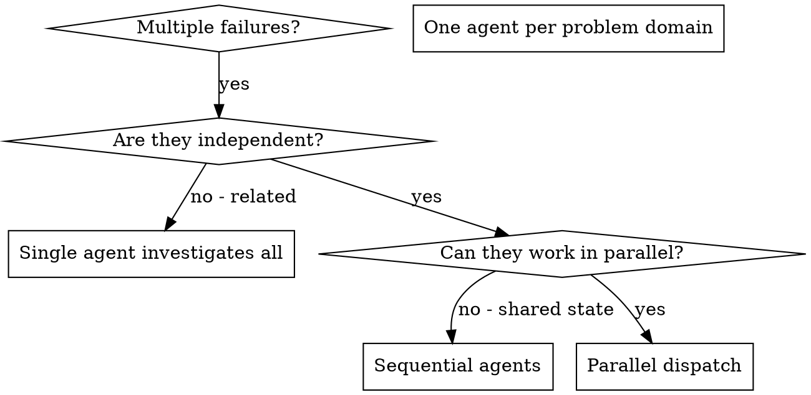

# 并行代理调度

## 概述

你将任务委托给具有隔离上下文的专用代理。通过精确编写它们的指令和上下文，你可以确保它们保持专注并成功完成任务。它们永远不应该继承你会话的上下文或历史——你构建它们所需的精确内容。这也为你自己的协调工作保留了上下文。

当你有多个不相关的失败（不同的测试文件、不同的子系统、不同的 bug）时，顺序调查会浪费时间。每项调查都是独立的，可以并行进行。

**核心原则：** 每个独立问题域分配一个代理。让它们并发工作。

## 何时使用



**使用场景：**
- 3 个或更多测试文件因不同根因失败
- 多个子系统独立损坏
- 每个问题可以在不依赖其他上下文的情况下理解
- 调查之间无共享状态

**不要使用：**
- 失败相关联（修复一个可能修复其他）
- 需要了解完整系统状态
- 代理会相互干扰

## 模式

### 1. 识别独立域

按故障内容分组：
- 文件 A 测试：工具审批流程
- 文件 B 测试：批量完成行为
- 文件 C 测试：中止功能

每个域独立——修复工具审批不影响中止测试。

### 2. 创建专注的代理任务

每个代理获得：
- **特定范围：** 一个测试文件或子系统
- **明确目标：** 让这些测试通过
- **约束：** 不要修改其他代码
- **预期输出：** 发现内容和修复内容的总结

### 3. 并行调度

```typescript
// 在 Claude Code / AI 环境中
Task("Fix agent-tool-abort.test.ts failures")
Task("Fix batch-completion-behavior.test.ts failures")
Task("Fix tool-approval-race-conditions.test.ts failures")
// 三个任务并发运行
```

### 4. 审查和整合

代理返回时：
- 阅读每个总结
- 验证修复不冲突
- 运行完整测试套件
- 整合所有变更

## 代理提示结构

好的代理提示：
1. **专注** —— 一个明确的问题域
2. **自包含** —— 理解问题所需的完整上下文
3. **输出具体** —— 代理应该返回什么？

```markdown
修复 src/agents/agent-tool-abort.test.ts 中 3 个失败的测试：

1. "should abort tool with partial output capture" - 期望消息中包含 'interrupted at'
2. "should handle mixed completed and aborted tools" - 快速工具被中止而非完成
3. "should properly track pendingToolCount" - 期望 3 个结果但得到 0

这些是时序/竞态条件问题。你的任务：

1. 阅读测试文件，理解每个测试验证的内容
2. 找出根因——是时序问题还是实际 bug？
3. 修复方法：
   - 用基于事件的等待替换任意超时
   - 如果发现中止实现中的 bug 则修复
   - 如果测试了变更的行为则调整测试期望

不要仅仅增加超时时间——要找出真正的问题。

返回：发现内容和修复内容的总结。
```

## 常见错误

**❌ 范围太广：** "修复所有测试" —— 代理会迷失
**✅ 具体：** "修复 agent-tool-abort.test.ts" —— 专注范围

**❌ 无上下文：** "修复竞态条件" —— 代理不知道在哪里
**✅ 上下文：** 粘贴错误消息和测试名称

**❌ 无约束：** 代理可能会重构一切
**✅ 约束：** "不要修改生产代码" 或 "只修复测试"

**❌ 输出模糊：** "修复它" —— 你不知道发生了什么
**✅ 具体：** "返回根因和变更的总结"

## 何时不使用

**相关失败：** 修复一个可能修复其他——先一起调查
**需要完整上下文：** 理解需要查看整个系统
**探索性调试：** 你还不知道哪里坏了
**共享状态：** 代理会相互干扰（编辑相同文件、使用相同资源）

## 真实示例（来自会话）

**场景：** 重大重构后 3 个文件中的 6 个测试失败

**失败：**
- agent-tool-abort.test.ts: 3 个失败（时序问题）
- batch-completion-behavior.test.ts: 2 个失败（工具未执行）
- tool-approval-race-conditions.test.ts: 1 个失败（执行计数 = 0）

**决策：** 独立域——中止逻辑与批量完成分离，与竞态条件分离

**调度：**
```
代理 1 → 修复 agent-tool-abort.test.ts
代理 2 → 修复 batch-completion-behavior.test.ts
代理 3 → 修复 tool-approval-race-conditions.test.ts
```

**结果：**
- 代理 1：用基于事件的等待替换超时
- 代理 2：修复事件结构 bug（threadId 位置错误）
- 代理 3：添加等待异步工具执行完成

**整合：** 所有修复独立，无冲突，完整套件通过

**节省时间：** 3 个问题并行解决 vs 顺序解决

## 核心优势

1. **并行化** —— 多项调查同时进行
2. **专注** —— 每个代理范围窄，需要跟踪的上下文少
3. **独立性** —— 代理互不干扰
4. **速度** —— 3 个问题用 1 个问题的时间解决

## 验证

代理返回后：
1. **审查每个总结** —— 理解发生了什么变更
2. **检查冲突** —— 代理是否编辑了相同的代码？
3. **运行完整套件** —— 验证所有修复一起工作
4. **抽查** —— 代理可能犯系统性错误

## 实际影响

来自调试会话（2025-10-03）：
- 3 个文件中的 6 个失败
- 3 个代理并行调度
- 所有调查并发完成
- 所有修复成功整合
- 代理变更之间零冲突
