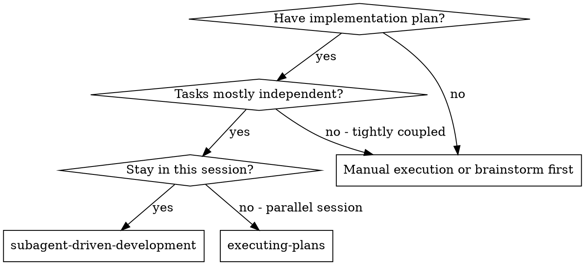
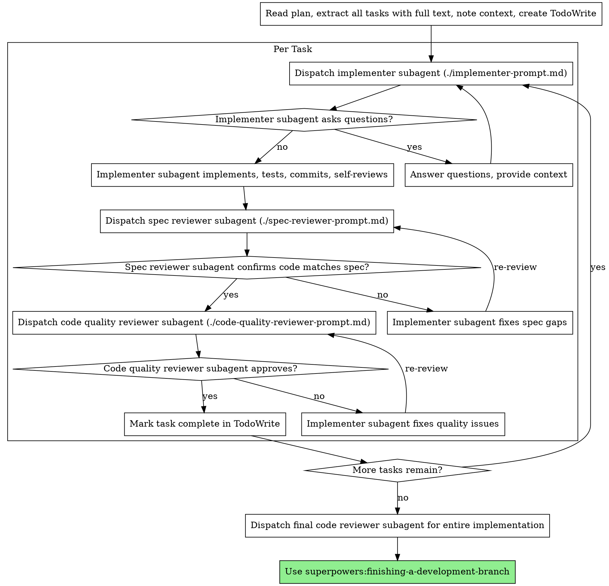

# 子代理驱动开发

通过为每个任务分派新的子代理来执行计划，并在每个任务后进行两阶段审查：首先进行规范合规审查，然后进行代码质量审查。

**为什么使用子代理：** 你将任务委托给具有隔离上下文的专用代理。通过精心设计它们的指令和上下文，你可以确保它们保持专注并成功完成其任务。它们不应继承你的会话上下文或历史——你精确构建它们所需的内容。这也为协调工作保留了你自己的上下文。

**核心原则：** 每个任务一个新子代理 + 两阶段审查（先规范后质量）= 高质量、快速迭代

**持续执行：** 不要在任务之间停下来与你的合作伙伴检查。继续执行计划中的所有任务，不要停止。唯一需要停止的原因是：无法解决的 BLOCKED 状态、真正阻碍进度的歧义，或所有任务都已完成。"我应该继续吗？"提示和进度总结会浪费他们的时间——他们要求你执行计划，所以执行它。

## 何时使用



**vs. 执行计划（并行会话）：**
- 同一会话（无上下文切换）
- 每个任务一个新子代理（无上下文污染）
- 每个任务后进行两阶段审查：先规范合规，后代码质量
- 更快迭代（任务之间无人工介入）

## 执行流程



## 模型选择

使用能处理每个角色且功能最弱的模型，以节省成本并提高速度。

**机械性实现任务**（独立函数、清晰规范、1-2个文件）：使用快速、便宜的模型。当计划 specification 良好时，大多数实现任务都是机械性的。

**集成和判断任务**（多文件协调、模式匹配、调试）：使用标准模型。

**架构、设计和审查任务**：使用能力最强的可用模型。

**任务复杂度信号：**
- 涉及1-2个文件且有完整规范 → 便宜模型
- 涉及多个文件并有集成问题 → 标准模型
- 需要设计判断或广泛的代码库理解 → 能力最强的模型

## 处理实施者状态

实施者子代理报告四种状态之一。适当处理每种状态：

**DONE：** 继续进行规范合规审查。

**DONE_WITH_CONCERNS：** 实施者完成了工作但标记了疑问。在继续之前阅读这些疑问。如果疑问涉及正确性或范围，在审查之前解决它们。如果它们是观察结果（例如"这个文件越来越大了"），请记下它们并继续审查。

**NEEDS_CONTEXT：** 实施者需要未提供的信息。提供缺失的上下文并重新分派。

**BLOCKED：** 实施者无法完成任务。评估阻塞原因：
1. 如果是上下文问题，提供更多上下文并用相同的模型重新分派
2. 如果任务需要更多推理，用能力更强的模型重新分派
3. 如果任务太大，将其拆分成更小的部分
4. 如果计划本身有问题，升级给人类

**绝不**忽略升级或强制相同模型在无变化的情况下重试。如果实施者说它卡住了，需要改变一些东西。

## 提示模板

- `./implementer-prompt.md` - 分派实施者子代理
- `./spec-reviewer-prompt.md` - 分派规范合规审查者子代理
- `./code-quality-reviewer-prompt.md` - 分派代码质量审查者子代理

## 示例工作流程

```
你：我正在使用子代理驱动开发来执行此计划。

[读取计划文件一次：docs/superpowers/plans/feature-plan.md]
[提取所有5个任务及其完整文本和上下文]
[创建包含所有任务的 TodoWrite]

任务1：钩子安装脚本

[获取任务1的文本和上下文（已提取）]
[分派带有完整任务文本+上下文的实现子代理]

实施者："在我开始之前——钩子应该安装在用户级别还是系统级别？"

你："用户级别（~/.config/superpowers/hooks/）"

实施者："明白了。正在实现..."
[稍后] 实施者：
  - 实现了 install-hook 命令
  - 添加了测试，5/5 通过
  - 自我审查：发现我遗漏了 --force 标志，已添加
  - 已提交

[分派规范合规审查者]
规范审查者：✅ 符合规范 - 所有要求均已满足，无额外内容

[获取 git SHA，分派代码质量审查者]
代码审查者：优点：良好的测试覆盖率，代码清晰。问题：无。已批准。

[标记任务1完成]

任务2：恢复模式

[获取任务2的文本和上下文（已提取）]
[分派带有完整任务文本+上下文的实现子代理]

实施者：[无问题，继续进行]
实施者：
  - 添加了 verify/repair 模式
  - 8/8 测试通过
  - 自我审查：一切良好
  - 已提交

[分派规范合规审查者]
规范审查者：❌ 问题：
  - 缺失：进度报告（规范说"每100个项目报告一次"）
  - 额外：添加了 --json 标志（未请求）

[实施者修复问题]
实施者：删除了 --json 标志，添加了进度报告

[规范审查者再次审查]
规范审查者：✅ 现在符合规范

[分派代码质量审查者]
代码审查者：优点：扎实。问题（重要）：魔法数字（100）

[实施者修复]
实施者：提取了 PROGRESS_INTERVAL 常量

[代码审查者再次审查]
代码审查者：✅ 已批准

[标记任务2完成]

...

[所有任务之后]
[分派最终代码审查者]
最终审查者：所有要求均已满足，可以合并

完成！
```

## 优势

**vs. 手动执行：**
- 子代理自然遵循 TDD
- 每个任务新鲜上下文（无混淆）
- 并行安全（子代理不会相互干扰）
- 子代理可以提问（工作前和工作期间都可以）

**vs. 执行计划：**
- 同一会话（无需交接）
- 持续进度（无需等待）
- 审查检查点自动进行

**效率提升：**
- 无文件读取开销（控制器提供完整文本）
- 控制器精确策划所需上下文
- 子代理立即获得完整信息
- 问题在工作开始前浮现（不是之后）

**质量门禁：**
- 自我审查在交接前发现问题
- 两阶段审查：规范合规，然后代码质量
- 审查循环确保修复实际有效
- 规范合规防止过度/不足构建
- 代码质量确保实现构建良好

**成本：**
- 更多子代理调用（每个任务一个实施者 + 2个审查者）
- 控制器做更多准备工作（提前提取所有任务）
- 审查循环增加迭代
- 但能及早发现问题（比以后调试便宜）

## 红旗（警示信号）

**绝不：**
- 在 main/master 分支上开始实现（未经明确用户同意）
- 跳过审查（规范合规或代码质量）
- 在问题未修复的情况下继续
- 并行分派多个实现子代理（冲突）
- 让子代理读取计划文件（改而提供完整文本）
- 跳过场景设置上下文（子代理需要理解任务所在位置）
- 忽略子代理的问题（在让它们继续之前回答）
- 接受规范合规上"差不多就行"（规范审查者发现问题 = 未完成）
- 跳过审查循环（审查者发现问题 = 实施者修复 = 再次审查）
- 让实施者自我审查取代实际审查（两者都需要）
- **在规范合规审查 ✅ 之前开始代码质量审查**（顺序错误）
- 在任一审查有未解决问题时进入下一任务

**如果子代理提问：**
- 清晰完整地回答
- 如有需要提供额外上下文
- 不要匆忙让他们进入实现

**如果审查者发现问题：**
- 实施者（相同的子代理）修复它们
- 审查者再次审查
- 重复直到批准
- 不要跳过重新审查

**如果子代理任务失败：**
- 用特定指令分派修复子代理
- 不要尝试手动修复（上下文污染）

## 集成

**必需的工作流技能：**
- **superpowers:using-git-worktrees** - 确保隔离的工作空间（创建一个或验证现有）
- **superpowers:writing-plans** - 创建此技能执行的计划
- **superpowers:requesting-code-review** - 审查者子代理的代码审查模板
- **superpowers:finishing-a-development-branch** - 所有任务完成后完成开发

**子代理应使用：**
- **superpowers:test-driven-development** - 子代理对每个任务遵循 TDD

**替代工作流：**
- **superpowers:executing-plans** - 用于并行会话而非同一会话执行
