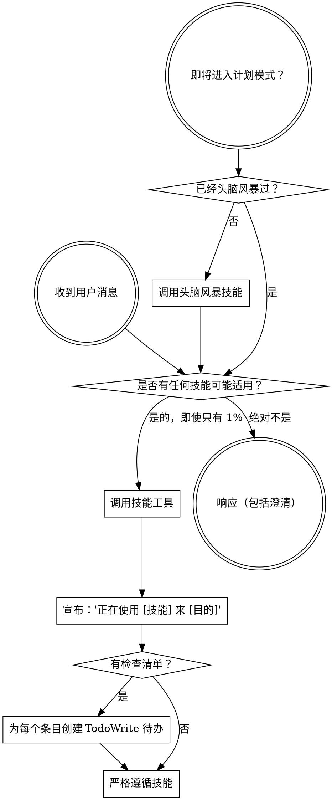

<SUBAGENT-STOP>
如果你作为子代理被派去执行特定任务，请跳过此技能。
</SUBAGENT-STOP>

<EXTREMELY-IMPORTANT>
如果你认为技能有哪怕 1% 的可能性适用于你正在做的事情，你必须绝对调用这个技能。

如果技能适用于你的任务，你没有选择。你必须使用它。

这是不可商量的。这是可选的。你不能通过理性来绕过这一点。
</EXTREMELY-IMPORTANT>

## 指令优先级

Superpowers 技能覆盖默认的系统提示行为，但 **用户指令始终优先**：

1. **用户的明确指令**（CLAUDE.md、GEMINI.md、AGENTS.md、直接请求）——最高优先级
2. **Superpowers 技能**——在冲突处覆盖默认系统行为
3. **默认系统提示**——最低优先级

如果 CLAUDE.md、GEMINI.md 或 AGENTS.md 说"不要使用 TDD"，而技能说"总是使用 TDD"，请遵循用户的指令。用户才是掌控者。

## 如何访问技能

**在 Claude Code 中：** 使用 `Skill` 工具。当你调用一个技能时，它的内容会被加载并呈现给你——直接遵循它。不要用 Read 工具读取技能文件。

**在 Copilot CLI 中：** 使用 `skill` 工具。技能从已安装的插件中自动发现。`skill` 工具的工作方式与 Claude Code 的 `Skill` 工具相同。

**在 Gemini CLI 中：** 技能通过 `activate_skill` 工具激活。Gemini 在会话开始时加载技能元数据，并根据需要激活完整内容。

**在其他环境中：** 请查看你平台的文档以了解技能如何加载。

## 平台适配

技能使用 Claude Code 工具名称。非 CC 平台：参见 `references/copilot-tools.md`（Copilot CLI）、`references/codex-tools.md`（Codex）了解工具对应关系。Gemini CLI 用户通过 GEMINI.md 自动加载工具映射。

# 使用技能

## 规则

**在任何响应或操作之前调用相关或请求的技能。** 即使有 1% 的可能性技能适用，也应该调用技能来检查。如果调用的技能最终证明不适合情况，你不需要使用它。

## 红旗（危险信号）

这些想法意味着停止——你在合理化：

| 想法 | 现实 |
|---------|---------|
| "这只是一个简单的问题" | 问题就是任务。检查技能。 |
| "我需要先获取更多上下文" | 技能检查在澄清问题之前。 |
| "让我先探索代码库" | 技能告诉你如何探索。先检查。 |
| "我可以快速检查 git/文件" | 文件缺乏对话上下文。检查技能。 |
| "让我先收集信息" | 技能告诉你如何收集信息。 |
| "这不需要正式的技能" | 如果技能存在，使用它。 |
| "我记得这个技能" | 技能在发展。阅读当前版本。 |
| "这不算作任务" | 行动 = 任务。检查技能。 |
| "技能有点大材小用" | 简单的事情会变得复杂。使用它。 |
| "我就先做这一件事" | 在做任何事情之前检查。 |
| "这感觉很有成效" | 无纪律的行动浪费时间。技能防止这种情况。 |
| "我知道那是什么意思" | 知道概念 ≠ 使用技能。调用它。 |

## 技能优先级

当多个技能可能适用时，按此顺序使用：

1. **流程技能优先**（头脑风暴、调试）——这些决定如何处理任务
2. **实现技能其次**（前端设计、mcp-builder）——这些指导执行

"让我们构建 X" → 先头脑风暴，然后实现技能。
"修复这个 bug" → 先调试，然后领域特定技能。

## 技能类型

**严格型**（TDD、调试）：严格遵循。不要adapt away discipline。

**灵活型**（模式）：根据上下文调整原则。

技能本身会告诉你属于哪种。

## 用户指令

指令说的是 WHAT，不是 HOW。"添加 X"或"修复 Y"并不意味着跳过工作流程。
