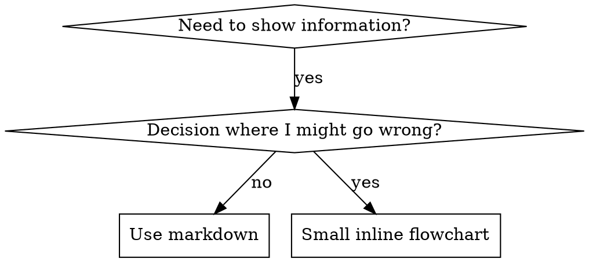

# 编写技能

## 概述

**编写技能就是将测试驱动开发应用于流程文档。**

**个人技能存放在特定代理目录中（Claude Code 用 `~/.claude/skills`，Codex 用 `~/.agents/skills/`）**

编写测试用例（带子代理的压力场景），观察它们失败（基线行为），编写技能（文档），观察测试通过（代理遵守），然后重构（堵住漏洞）。

**核心原则：** 如果你没有亲眼看到代理在没有技能的情况下失败，你就没有办法确定这个技能教的是正确的东西。

**必读背景：** 在使用此技能之前，你必须理解 superpowers:test-driven-development。该技能定义了基础的 RED-GREEN-REFACTOR 循环。本技能将 TDD 应用于文档编写。

**官方指导：** 关于 Anthropic 官方技能编写最佳实践，请参阅 anthropic-best-practices.md。本文档提供了补充 TDD 方法的额外模式和指南。

## 什么是技能？

**技能**是经过验证的技术、模式或工具的参考指南。技能帮助未来的 Claude 实例找到并应用有效的方法。

**技能是：** 可复用的技术、模式、工具、参考指南

**技能不是：** 关于你如何一次性解决某个问题的叙述

## 技能创建的 TDD 映射

| TDD 概念 | 技能创建 |
|-------------|----------------|
| **测试用例** | 带子代理的压力场景 |
| **生产代码** | 技能文档（SKILL.md） |
| **测试失败（RED）** | 没有技能时代理违反规则（基线） |
| **测试通过（GREEN）** | 有技能时代理遵守规则 |
| **重构** | 在保持合规性的同时堵住漏洞 |
| **先写测试** | 在写技能之前运行基线场景 |
| **观察失败** | 记录代理使用的确切理由 |
| **最小代码** | 编写针对这些特定违规行为的技能 |
| **观察通过** | 验证代理现在遵守规则 |
| **重构循环** | 发现新的合理化理由 → 堵住 → 重新验证 |

整个技能创建过程遵循 RED-GREEN-REFACTOR。

## 何时创建技能

**创建时机：**
- 该技术对你来说不是直觉上显而易见的
- 你会在不同项目中再次引用它
- 该模式广泛适用（不是项目特定的）
- 其他人也会受益

**不要为以下内容创建：**
- 一次性解决方案
- 在其他地方已有详细记录的标准实践
- 项目特定的约定（放在 CLAUDE.md 中）
- 机械性约束（如果是可强制执行的，用正则/验证自动化——把文档留给需要判断的情况）

## 技能类型

### 技术
具有明确步骤的具体方法（condition-based-waiting，root-cause-tracing）

### 模式
思考问题的方式（flatten-with-flags，test-invariants）

### 参考
API 文档、语法指南、工具文档（office docs）

## 目录结构


```
skills/
  skill-name/
    SKILL.md              # 主参考（必需）
    supporting-file.*     # 仅在需要时添加
```

**扁平命名空间** - 所有技能在一个可搜索的命名空间中

**单独文件用于：**
1. **重型参考**（100+ 行）- API 文档、全面的语法
2. **可复用工具** - 脚本、实用程序、模板

**保持内联：**
- 原则和概念
- 代码模式（< 50 行）
- 其他一切

## SKILL.md 结构

**Frontmatter（YAML）：**
- 两个必填字段：`name` 和 `description`（请参阅 [agentskills.io/specification](https://agentskills.io/specification) 了解所有支持的字段）
- 总共最多 1024 个字符
- `name`：仅使用字母、数字和连字符（不含括号、特殊字符）
- `description`：第三人称，仅描述何时使用（不是做什么）
  - 以 "Use when..." 开头，聚焦于触发条件
  - 包含具体症状、情境和上下文
  - **永远不要总结技能的过程或工作流**（参见 CSO 部分了解原因）
  - 如果可以，保持在 500 字符以下

```markdown
---
name: Skill-Name-With-Hyphens
description: Use when [specific triggering conditions and symptoms]
---

# Skill Name

## Overview
这是什么？用 1-2 句话描述核心原则。

## When to Use
[如果决策不明显，使用小型内联流程图]

带症状和使用案例的项目符号列表
何时不使用

## Core Pattern (for techniques/patterns)
之前/之后的代码对比

## Quick Reference
扫描常用操作的表格或项目符号

## Implementation
简单模式的内联代码
重型参考或可复用工具的文件链接

## Common Mistakes
出问题的地方 + 修复方法

## Real-World Impact (optional)
具体结果
```


## Claude 搜索优化（CSO）

**发现的关键：** 未来的 Claude 需要找到你的技能

### 1. 丰富的 Description 字段

**目的：** Claude 读取 description 来决定为给定任务加载哪些技能。使其回答："我现在应该读这个技能吗？"

**格式：** 以 "Use when..." 开头，聚焦于触发条件

**关键：Description = 何时使用，不是技能做什么**

description 应该只描述触发条件。不要在 description 中总结技能的过程或工作流。

**为什么这很重要：** 测试揭示，当 description 总结技能的工作流时，Claude 可能会跟随 description 而非阅读完整的技能内容。一个说 "任务之间的代码审查" 的 description 导致 Claude 只做了一次审查，尽管技能的流程图清楚地显示了两次审查（规范合规性检查，然后是代码质量检查）。

当 description 改为仅 "Use when executing implementation plans with independent tasks"（没有工作流总结）时，Claude 正确地阅读了流程图并遵循了两阶段审查流程。

**陷阱：** 总结工作流的 description 创造了 Claude 会走的捷径。技能正文变成了 Claude 跳过的文档。

```yaml
# ❌ 不好：总结了工作流 - Claude 可能会跟着这个走而不读技能
description: Use when executing plans - dispatches subagent per task with code review between tasks

# ❌ 不好：太多流程细节
description: Use for TDD - write test first, watch it fail, write minimal code, refactor

# ✅ 好：只有触发条件，没有工作流总结
description: Use when executing implementation plans with independent tasks in the current session

# ✅ 好：只有触发条件
description: Use when implementing any feature or bugfix, before writing implementation code
```

**内容：**
- 使用具体的触发器、症状和信号此技能适用的情境
- 描述*问题*（竞态条件、不一致行为）而不是*特定语言的症状*（setTimeout、sleep）
- 保持触发器技术无关，除非技能本身是技术特定的
- 如果技能是技术特定的，在触发器中明确说明
- 用第三人称写作（注入到系统提示中）
- **永远不要总结技能的过程或工作流**

```yaml
# ❌ 不好：太抽象、太模糊、没有包含使用时机
description: For async testing

# ❌ 不好：第一人称
description: I can help you with async tests when they're flaky

# ❌ 不好：提到了技术但技能并不特定于它
description: Use when tests use setTimeout/sleep and are flaky

# ✅ 好：以 "Use when" 开头，描述问题，没有工作流
description: Use when tests have race conditions, timing dependencies, or pass/fail inconsistently

# ✅ 好：技术特定的技能，有明确的触发器
description: Use when using React Router and handling authentication redirects
```

### 2. 关键词覆盖

使用 Claude 会搜索的词：
- 错误信息："Hook timed out"、"ENOTEMPTY"、"race condition"
- 症状："flaky"、"hanging"、"zombie"、"pollution"
- 同义词："timeout/hang/freeze"、"cleanup/teardown/afterEach"
- 工具：实际命令、库名、文件类型

### 3. 描述性命名

**使用主动语态，动词优先：**
- ✅ `creating-skills` 而不是 `skill-creation`
- ✅ `condition-based-waiting` 而不是 `async-test-helpers`

### 4. Token 效率（关键）

**问题：** getting-started 和频繁引用的技能加载到每个对话中。每个 token 都重要。

**目标字数：**
- getting-started 工作流：每个 <150 词
- 频繁加载的技能：总共 <200 词
- 其他技能：<500 词（仍然要简洁）

**技术：**

**将细节移到工具帮助：**
```bash
# ❌ 不好：在 SKILL.md 中记录所有标志
search-conversations supports --text, --both, --after DATE, --before DATE, --limit N

# ✅ 好：引用 --help
search-conversations supports multiple modes and filters. Run --help for details.
```

**使用交叉引用：**
```markdown
# ❌ 不好：重复工作流细节
When searching, dispatch subagent with template...
[20 lines of repeated instructions]

# ✅ 好：引用其他技能
Always use subagents (50-100x context savings). REQUIRED: Use [other-skill-name] for workflow.
```

**压缩示例：**
```markdown
# ❌ 不好：冗长的示例（42 词）
your human partner: "How did we handle authentication errors in React Router before?"
You: I'll search past conversations for React Router authentication patterns.
[Dispatch subagent with search query: "React Router authentication error handling 401"]

# ✅ 好：最简示例（20 词）
Partner: "How did we handle auth errors in React Router?"
You: Searching...
[Dispatch subagent → synthesis]
```

**消除冗余：**
- 不要重复交叉引用的技能中的内容
- 不要解释从命令中显而易见的内容
- 不要包含同一模式的多个示例

**验证：**
```bash
wc -w skills/path/SKILL.md
# getting-started 工作流：目标每个 <150
# 其他频繁加载：目标总共 <200
```

**按你做的或核心洞察命名：**
- ✅ `condition-based-willing` > `async-test-helpers`
- ✅ `using-skills` 不是 `skill-usage`
- ✅ `flatten-with-flags` > `data-structure-refactoring`
- ✅ `root-cause-tracing` > `debugging-techniques`

**动名词（-ing）适合流程：**
- `creating-skills`、`testing-skills`、`debugging-with-logs`
- 主动，描述你正在采取的行动

### 4. 交叉引用其他技能

**编写引用其他技能的文档时：**

仅使用技能名称，带明确的必需标记：
- ✅ 好：`**REQUIRED SUB-SKILL:** Use superpowers:test-driven-development`
- ✅ 好：`**REQUIRED BACKGROUND:** You MUST understand superpowers:systematic-debugging`
- ❌ 不好：`See skills/testing/test-driven-development`（不清楚是否必需）
- ❌ 不好：`@skills/testing/test-driven-development/SKILL.md`（强制加载，消耗上下文）

**为什么不用 @ 链接：** `@` 语法立即强制加载文件，在你需要之前消耗 200k+ 上下文。

## 流程图使用



**仅在以下情况使用流程图：**
- 决策不明显的非显而易见决策点
- 你可能过早停止的过程循环
- "何时用 A vs B" 的决策

**永远不要为以下情况使用流程图：**
- 参考材料 → 表格、列表
- 代码示例 → Markdown 代码块
- 线性说明 → 编号列表
- 没有语义意义的标签（step1、helper2）

请参阅 @graphviz-conventions.dot 了解 graphviz 样式规则。

**为你的伙伴可视化：** 使用此目录中的 `render-graphs.js` 将技能的流程图渲染为 SVG：
```bash
./render-graphs.js ../some-skill           # 每个图单独渲染
./render-graphs.js ../some-skill --combine # 所有图合并到一个 SVG
```

## 代码示例

**一个出色的示例胜过许多平庸的示例**

选择最相关的语言：
- 测试技术 → TypeScript/JavaScript
- 系统调试 → Shell/Python
- 数据处理 → Python

**好的示例：**
- 完整且可运行
- 注释良好，解释为什么
- 来自真实场景
- 清晰展示模式
- 可直接适配（不是通用模板）

**不要：**
- 用 5+ 种语言实现
- 创建填空模板
- 编写人为的例子

你擅长移植——一个好的示例就够了。

## 文件组织

### 自包含技能
```
defense-in-depth/
  SKILL.md    # 所有内容内联
```
当：所有内容都适合，没有重型参考需要

### 带可复用工具的技能
```
condition-based-waiting/
  SKILL.md    # 概述 + 模式
  example.ts  # 可适配的工作辅助工具
```
当：工具是可复用的代码，而不仅仅是叙述

### 带重型参考的技能
```
pptx/
  SKILL.md       # 概述 + 工作流
  pptxgenjs.md   # 600 行 API 参考
  ooxml.md       # 500 行 XML 结构
  scripts/       # 可执行工具
```
当：参考材料太大无法内联

## 铁律（与 TDD 相同）

```
没有失败的测试就没有技能
```

这适用于新技能和现有技能的编辑。

没有先测试就写技能？删除它。重新开始。
没有测试就编辑技能？同样的违规。
没有例外：
- 不是因为"简单添加"
- 不是因为"只是加一个章节"
- 不是因为"文档更新"
- 不要保留未测试的更改作为"参考"
- 不要在运行测试时"改编"
- 删除意味着删除

**必读背景：** superpowers:test-driven-development 技能解释了这为什么重要。原则同样适用于文档。

## 测试所有技能类型

不同类型的技能需要不同的测试方法：

### 纪律执行技能（规则/要求）

**示例：** TDD、verification-before-completion、designing-before-coding

**测试：**
- 学术问题：他们理解规则吗？
- 压力场景：他们在压力下遵守吗？
- 多种压力结合：时间 + 沉没成本 + 疲劳
- 识别合理化理由并添加明确的反例

**成功标准：** 代理在最大压力下遵守规则

### 技术技能（操作指南）

**示例：** condition-based-waiting、root-cause-tracing、defensive-programming

**测试：**
- 应用场景：他们能正确应用技术吗？
- 变体场景：他们处理边界情况吗？
- 缺失信息测试：指令有缺口吗？

**成功标准：** 代理成功将技术应用于新场景

### 模式技能（心智模型）

**示例：** reducing-complexity、information-hiding concepts

**测试：**
- 识别场景：他们识别出模式适用的时候吗？
- 应用场景：他们能使用心智模型吗？
- 反例：他们知道何时不应用吗？

**成功标准：** 代理正确识别何时/如何应用模式

### 参考技能（文档/API）

**示例：** API 文档、命令参考、库指南

**测试：**
- 检索场景：他们能找到正确的信息吗？
- 应用场景：他们能正确使用找到的内容吗？
- 缺口测试：常见用例都有覆盖吗？

**成功标准：** 代理找到并正确应用参考信息

## 跳过测试的常见合理化理由

| 借口 | 现实 |
|--------|---------|
| "技能明显很清楚" | 对你清楚 ≠ 对其他代理清楚。测试它。 |
| "这只是一个参考" | 参考可能有缺口、不清楚的部分。测试检索。 |
| "测试是过度工程" | 未测试的技能有问题。总是会有的。15 分钟测试节省数小时。 |
| "如果出现问题我会测试" | 问题 = 代理无法使用技能。部署前测试。 |
| "太繁琐了不想测试" | 测试比在生产中调试坏技能更不繁琐。 |
| "我自信它是好的" | 过度自信保证有问题。还是要测试。 |
| "学术审查就够了" | 阅读 ≠ 使用。测试应用场景。 |
| "没有时间测试" | 部署未测试的技能会浪费更多时间修复它。 |

**所有这些意味着：部署前测试。没有例外。**

## 用合理化理由加固技能

执行纪律的技能（如 TDD）需要抵抗合理化。代理很聪明，在压力下会找到漏洞。

**心理学笔记：** 理解为什么说服技术有效帮助你系统地应用它们。请参阅 persuasion-principles.md 了解权威、承诺、稀缺、社会证明和统一原则的研究基础（Cialdini, 2021; Meincke et al., 2025）。

### 明确堵住每个漏洞

不要只是陈述规则 - 禁止特定的变通方法：

<不好>
```markdown
在测试之前写代码？删除它。
```
</不好>

<好>
```markdown
在测试之前写代码？删除它。重新开始。

**没有例外：**
- 不要保留它作为"参考"
- 不要在写测试时"改编"它
- 不要看它
- 删除意味着删除
```
</好>

### 解决"精神与字面"争论

尽早添加基本原则：

```markdown
**违反规则的字面就是违反规则的精神。**
```

这切断了整类"我遵循精神"的合理化。

### 构建合理化理由表格

从基线测试中捕获合理化理由（参见下面的测试部分）。每个代理使用的借口都进入表格：

```markdown
| 借口 | 现实 |
|--------|---------|
| "太简单了不需要测试" | 简单代码也会坏。测试只需 30 秒。 |
| "我之后会测试" | 测试立即通过什么都证明不了。 |
| "之后测试达到相同目标" | 之后测试 = "这是做什么的？" 先测试 = "这应该做什么？" |
```

### 创建红旗列表

使代理容易自我检查何时在合理化：

```markdown
## 红旗 - 停止并重新开始

- 在测试之前写代码
- "我已经手动测试过了"
- "之后测试达到相同目的"
- "这是关于精神而不是仪式"
- "这次不一样因为..."

**所有这些意味着：删除代码。用 TDD 重新开始。**
```

### 为违规症状更新 CSO

添加到 description：当你即将违反规则时的症状：

```yaml
description: use when implementing any feature or bugfix, before writing implementation code
```

## 技能的 RED-GREEN-REFACTOR

遵循 TDD 循环：

### RED：编写失败的测试（基线）

在没有技能的情况下，用子代理运行压力场景。记录确切行为：
- 他们做了什么选择？
- 他们使用了什么合理化理由（逐字）？
- 哪些压力触发了违规？

这是"观察测试失败" - 你必须看到代理在没有技能的情况下自然做什么。

### GREEN：编写最小技能

编写针对这些特定合理化理由的技能。不要为假设的情况添加额外内容。

用技能运行相同场景。代理现在应该遵守。

### REFACTOR：堵住漏洞

代理发现了新的合理化理由？添加明确的反例。重新测试直到无懈可击。

**测试方法论：** 请参阅 @testing-skills-with-subagents.md 了解完整的测试方法论：
- 如何编写压力场景
- 压力类型（时间、沉没成本、权威、疲劳）
- 系统地堵住漏洞
- 元测试技术

## 反模式

### ❌ 叙述性示例
"In session 2025-10-03, we found empty projectDir caused..."
**为什么不好：** 太特定，不可复用

### ❌ 多语言稀释
example-js.js, example-py.py, example-go.go
**为什么不好：** 质量平庸，维护负担

### ❌ 流程图中的代码
```dot
step1 [label="import fs"];
step2 [label="read file"];
```
**为什么不好：** 不能复制粘贴，难阅读

### ❌ 通用标签
helper1, helper2, step3, pattern4
**为什么不好：** 标签应该有语义含义

## 停止：移动到下一个技能之前

**在编写任何技能后，你必须停止并完成部署过程。**

**不要：**
- 批量创建多个技能而不测试每个
- 在当前技能验证完成之前移动到下一个
- 因为"批量更高效"而跳过测试

**下面的部署检查清单对每个技能都是强制性的。**

部署未测试的技能 = 部署未测试的代码。这违反质量标准。

## 技能创建检查清单（TDD 适配版）

**重要：使用 TodoWrite 为下面的每个检查清单项目创建待办事项。**

**RED 阶段 - 编写失败的测试：**
- [ ] 创建压力场景（纪律技能需要 3+ 种组合压力）
- [ ] 在没有技能的情况下运行场景 - 逐字记录基线行为
- [ ] 识别合理化/失败中的模式

**GREEN 阶段 - 编写最小技能：**
- [ ] 名称仅使用字母、数字、连字符（无括号/特殊字符）
- [ ] YAML frontmatter 包含必填的 `name` 和 `description` 字段（最多 1024 字符；参见 [规范](https://agentskills.io/specification)）
- [ ] Description 以 "Use when..." 开头，包含具体触发器/症状
- [ ] Description 用第三人称书写
- [ ] 关键词贯穿全文以便搜索（错误、症状、工具）
- [ ] 有明确的核心原则概述
- [ ] 解决 RED 阶段识别的具体基线失败
- [ ] 代码内联或链接到单独文件
- [ ] 一个出色的示例（不是多语言）
- [ ] 用技能运行场景 - 验证代理现在遵守

**REFACTOR 阶段 - 堵住漏洞：**
- [ ] 从测试中识别新的合理化理由
- [ ] 添加明确的反例（如果是纪律技能）
- [ ] 从所有测试迭代构建合理化理由表格
- [ ] 创建红旗列表
- [ ] 重新测试直到无懈可击

**质量检查：**
- [ ] 仅在决策不明显时使用小型流程图
- [ ] 快速参考表格
- [ ] 常见错误部分
- [ ] 无叙述性讲故事
- [ ] 仅工具或重型参考使用支持文件

**部署：**
- [ ] 将技能提交到 git 并推送到你的 fork（如果已配置）
- [ ] 考虑通过 PR 贡献回去（如果广泛有用）

## 发现工作流

未来的 Claude 如何找到你的技能：

1. **遇到问题**（"测试不稳定"）
3. **找到 SKILL**（description 匹配）
4. **扫描概述**（这相关吗？）
5. **阅读模式**（快速参考表）
6. **加载示例**（仅在实现时）

**为这个流程优化** - 把可搜索的词尽早且频繁地放置。

## 底线

**创建技能就是为流程文档的 TDD。**

同样的铁律：没有失败的测试就没有技能。
同样的循环：RED（基线）→ GREEN（写技能）→ REFACTOR（堵住漏洞）。
同样的好处：更好的质量、更少的意外、无懈可击的结果。

如果你为代码遵循 TDD，就为技能遵循它。这是应用于文档的相同纪律。